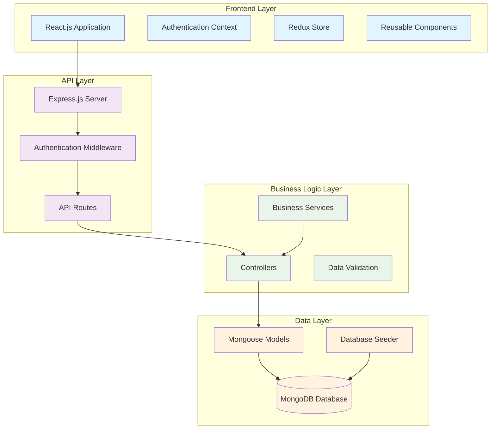
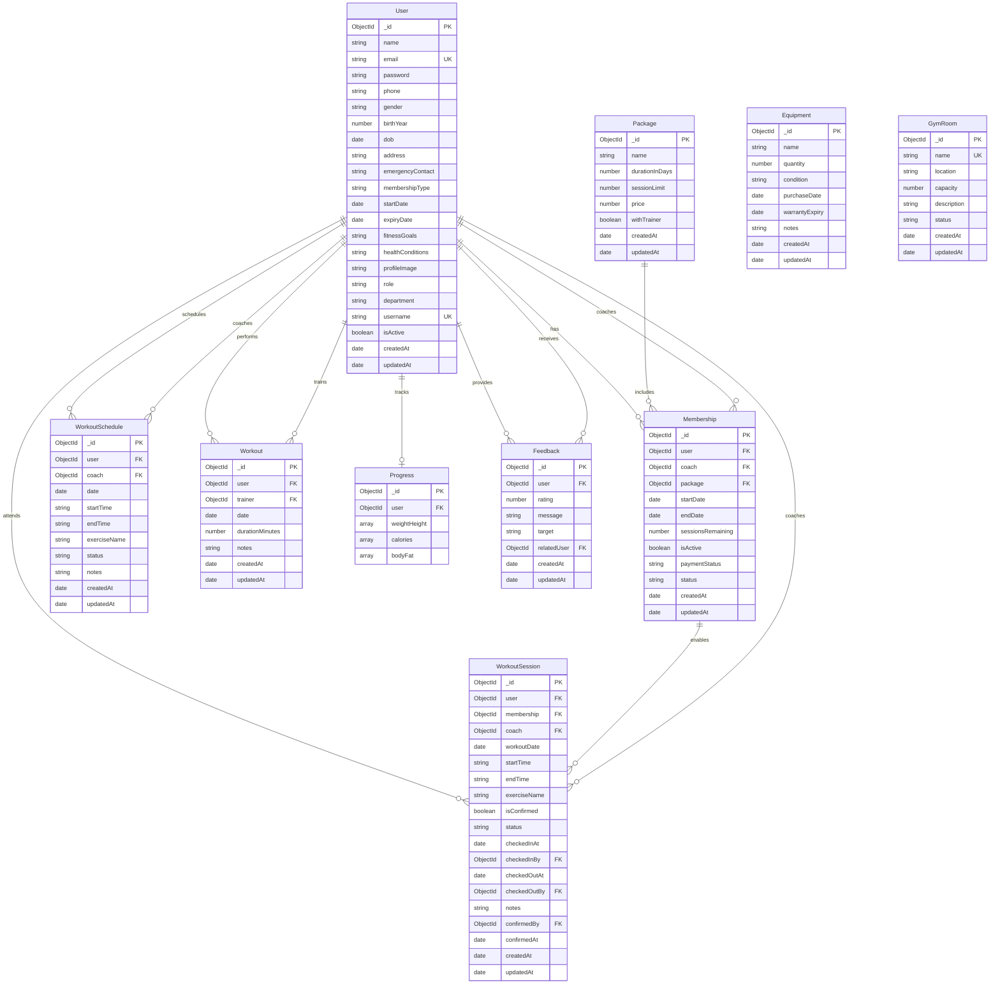
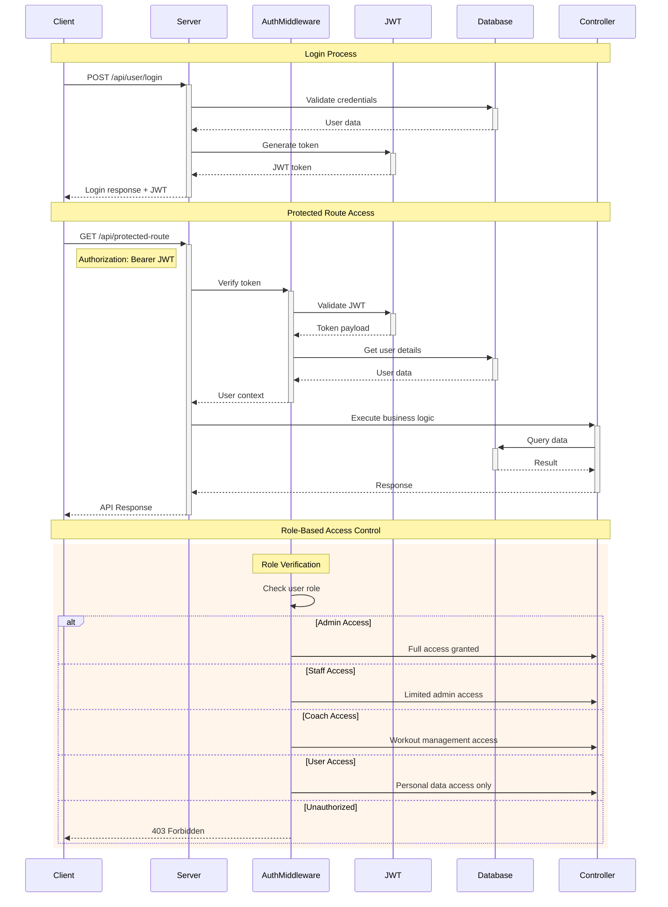
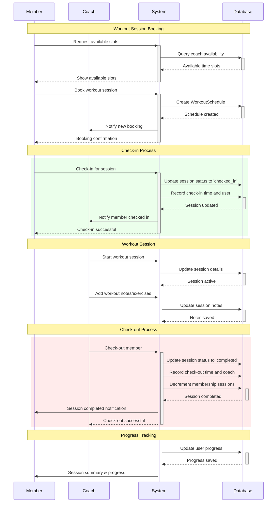
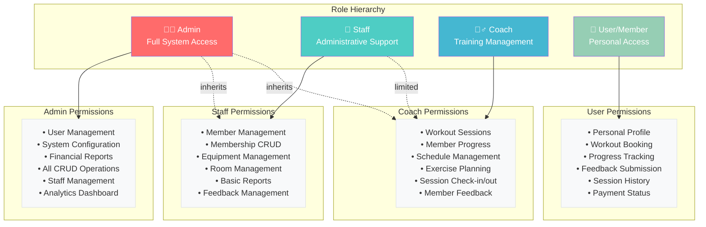

# ITSS Gym Management System

A comprehensive gym management system built with **Node.js/Express.js** backend and **React.js** frontend, featuring role-based access control, workout scheduling, membership management, and progress tracking.
user01@gmail.com
## 🏗️ System Architecture Overview



## 📊 Database Schema & Entity Relationships



## 🏛️ Backend Architecture Components

```mermaid
graph TB
    subgraph "Server Layer"
        Server[server.js<br/>Express App Setup]
        Config[Configuration<br/>DB Connection]
    end
    
    subgraph "Route Layer"
        UserRoute[User Routes<br/>/api/user/*]
        PackageRoute[Package Routes<br/>/api/package/*]
        MembershipRoute[Membership Routes<br/>/api/membership/*]
        EquipmentRoute[Equipment Routes<br/>/api/equipment/*]
        FeedbackRoute[Feedback Routes<br/>/api/feedbacks/*]
        GymRoomRoute[Gym Room Routes<br/>/api/gymroom/*]
        WorkoutRoute[Workout Routes<br/>/api/workout/*]
        SessionRoute[Workout Session Routes<br/>/api/workout-sessions/*]
        ScheduleRoute[Schedule Routes<br/>/api/schedule/*]
        ProgressRoute[Progress Routes<br/>/api/progress/*]
        StatisticRoute[Statistics Routes<br/>/api/statistics/*]
    end
    
    subgraph "Middleware Layer"
        AuthMiddleware[Authentication<br/>JWT Verification]
        RoleMiddleware[Role-Based Access<br/>Admin/Staff/Coach/User]
        ValidationMiddleware[Request Validation<br/>Data Sanitization]
    end
    
    subgraph "Controller Layer"
        UserController[User Controller<br/>CRUD Operations]
        PackageController[Package Controller<br/>Package Management]
        MembershipController[Membership Controller<br/>Subscription Logic]
        EquipmentController[Equipment Controller<br/>Inventory Management]
        FeedbackController[Feedback Controller<br/>Review System]
        GymRoomController[Gym Room Controller<br/>Facility Management]
        WorkoutController[Workout Controller<br/>Session Logging]
        SessionController[Session Controller<br/>Check-in/Check-out]
        ScheduleController[Schedule Controller<br/>Appointment Booking]
        ProgressController[Progress Controller<br/>Fitness Tracking]
        StatisticController[Statistics Controller<br/>Analytics & Reports]
    end
    
    subgraph "Model Layer"
        UserModel[User Model<br/>User Schema]
        PackageModel[Package Model<br/>Package Schema]
        MembershipModel[Membership Model<br/>Subscription Schema]
        EquipmentModel[Equipment Model<br/>Equipment Schema]
        FeedbackModel[Feedback Model<br/>Feedback Schema]
        GymRoomModel[Gym Room Model<br/>Room Schema]
        WorkoutModel[Workout Model<br/>Workout Schema]
        SessionModel[Session Model<br/>Session Schema]
        ScheduleModel[Schedule Model<br/>Schedule Schema]
        ProgressModel[Progress Model<br/>Progress Schema]
    end
    
    subgraph "Database Layer"
        MongoDB[(MongoDB<br/>Document Database)]
        Seeder[Database Seeder<br/>Initial Data Setup]
    end
    
    Server --> Config
    Server --> UserRoute
    Server --> PackageRoute
    Server --> MembershipRoute
    Server --> EquipmentRoute
    Server --> FeedbackRoute
    Server --> GymRoomRoute
    Server --> WorkoutRoute
    Server --> SessionRoute
    Server --> ScheduleRoute
    Server --> ProgressRoute
    Server --> StatisticRoute
    
    UserRoute --> AuthMiddleware
    PackageRoute --> AuthMiddleware
    MembershipRoute --> AuthMiddleware
    EquipmentRoute --> AuthMiddleware
    FeedbackRoute --> AuthMiddleware
    GymRoomRoute --> AuthMiddleware
    WorkoutRoute --> AuthMiddleware
    SessionRoute --> AuthMiddleware
    ScheduleRoute --> AuthMiddleware
    ProgressRoute --> AuthMiddleware
    StatisticRoute --> AuthMiddleware
    
    AuthMiddleware --> RoleMiddleware
    RoleMiddleware --> ValidationMiddleware
    
    ValidationMiddleware --> UserController
    ValidationMiddleware --> PackageController
    ValidationMiddleware --> MembershipController
    ValidationMiddleware --> EquipmentController
    ValidationMiddleware --> FeedbackController
    ValidationMiddleware --> GymRoomController
    ValidationMiddleware --> WorkoutController
    ValidationMiddleware --> SessionController
    ValidationMiddleware --> ScheduleController
    ValidationMiddleware --> ProgressController
    ValidationMiddleware --> StatisticController
    
    UserController --> UserModel
    PackageController --> PackageModel
    MembershipController --> MembershipModel
    EquipmentController --> EquipmentModel
    FeedbackController --> FeedbackModel
    GymRoomController --> GymRoomModel
    WorkoutController --> WorkoutModel
    SessionController --> SessionModel
    ScheduleController --> ScheduleModel
    ProgressController --> ProgressModel
    StatisticController --> UserModel
    StatisticController --> MembershipModel
    StatisticController --> WorkoutModel
    
    UserModel --> MongoDB
    PackageModel --> MongoDB
    MembershipModel --> MongoDB
    EquipmentModel --> MongoDB
    FeedbackModel --> MongoDB
    GymRoomModel --> MongoDB
    WorkoutModel --> MongoDB
    SessionModel --> MongoDB
    ScheduleModel --> MongoDB
    ProgressModel --> MongoDB
    
    Config --> MongoDB
    Seeder --> MongoDB
    
    classDef server fill:#ffebee
    classDef route fill:#e8f5e8
    classDef middleware fill:#fff3e0
    classDef controller fill:#e1f5fe
    classDef model fill:#f3e5f5
    classDef database fill:#fce4ec
    
    class Server,Config server
    class UserRoute,PackageRoute,MembershipRoute,EquipmentRoute,FeedbackRoute,GymRoomRoute,WorkoutRoute,SessionRoute,ScheduleRoute,ProgressRoute,StatisticRoute route
    class AuthMiddleware,RoleMiddleware,ValidationMiddleware middleware
    class UserController,PackageController,MembershipController,EquipmentController,FeedbackController,GymRoomController,WorkoutController,SessionController,ScheduleController,ProgressController,StatisticController controller
    class UserModel,PackageModel,MembershipModel,EquipmentModel,FeedbackModel,GymRoomModel,WorkoutModel,SessionModel,ScheduleModel,ProgressModel model
    class MongoDB,Seeder database
```



## 🔐 Authentication & Authorization Flow



## 🏃‍♂️ Workout Session Management Flow



## 📊 User Role Hierarchy & Permissions



## 🔄 Screen Flow Diagram

```mermaid
flowchart TD
    Start([Ứng dụng khởi động]) --> CheckAuth{Kiểm tra<br/>trạng thái đăng nhập}
    
    CheckAuth -->|Chưa đăng nhập| Login[🔐 Màn hình đăng nhập<br/>LoginPage]
    CheckAuth -->|Đã đăng nhập| RoleCheck{Kiểm tra vai trò<br/>người dùng}
    
    Login -->|Đăng nhập thành công| RoleCheck
    
    %% Admin Flow
    RoleCheck -->|Admin| AdminDash[👨‍💼 Admin Dashboard<br/>AdminDashboardPage]
    AdminDash --> AdminDevice[🖥️ Quản lý thiết bị<br/>AdminDevicePage]
    AdminDash --> AdminCustomer[👥 Quản lý khách hàng<br/>AdminCustomerPage]
    AdminDash --> AdminStaff[👔 Quản lý nhân viên<br/>AdminStaffPage]
    AdminDash --> AdminPackage[📦 Quản lý gói tập<br/>AdminPackagePage]
    AdminDash --> AdminReport[📊 Báo cáo thống kê<br/>AdminReportPage]
    AdminDash --> AdminFeedback[💬 Quản lý phản hồi<br/>AdminFeedbackPage]
    AdminDash --> AdminGymRoom[🏢 Quản lý phòng tập<br/>AdminGymRoomPage]
    
    %% Staff Flow
    RoleCheck -->|Staff| StaffDash[👥 Staff Dashboard<br/>StaffDashboardPage]
    StaffDash --> StaffCustomer[👤 Quản lý khách hàng<br/>StaffCustomerPage]
    StaffDash --> StaffSubscription[🎫 Quản lý thành viên<br/>StaffSubscriptionManagementPage]
    StaffDash --> StaffFeedback[💭 Quản lý phản hồi<br/>StaffFeedbackPage]
    StaffDash --> StaffDevice[⚙️ Quản lý thiết bị<br/>StaffDevicePage]
    StaffDash --> StaffGymRoom[🏠 Quản lý phòng tập<br/>StaffGymRoomPage]
    
    %% Coach Flow
    RoleCheck -->|Coach| CoachDash[🏋️‍♂️ Coach Dashboard<br/>Dashboard]
    CoachDash --> CoachClients[👥 Quản lý học viên<br/>Clients]
    CoachDash --> CoachSchedule[📅 Lịch tập<br/>Schedule]
    CoachDash --> CoachPrograms[📋 Chương trình tập<br/>TrainingPrograms]
    CoachDash --> CoachProgress[📈 Tiến độ tập luyện<br/>TrainingProgress]
    CoachDash --> CoachProfile[👤 Hồ sơ cá nhân<br/>Profiles]
    
    CoachProgress --> EditProgress[✏️ Chỉnh sửa tiến độ<br/>EditProgressScreen]
    EditProgress --> CoachProgress
    
    %% User Flow
    RoleCheck -->|User/Member| UserSchedule[📅 Lịch tập cá nhân<br/>UserSchedule]
    UserSchedule --> UserDash[📊 Trang chủ người dùng<br/>UserDashboard]
    UserSchedule --> UserProgress[📈 Tiến độ cá nhân<br/>UserProgress]
    UserSchedule --> UserMembership[🎫 Thông tin thành viên<br/>UserMembership]
    UserSchedule --> UserReview[⭐ Đánh giá dịch vụ<br/>UserReview]
    UserSchedule --> UserProfile[👤 Hồ sơ cá nhân<br/>UserProfile]
    
    %% Navigation between pages
    AdminDevice -.->|Điều hướng| AdminDash
    AdminCustomer -.->|Điều hướng| AdminDash
    AdminStaff -.->|Điều hướng| AdminDash
    AdminPackage -.->|Điều hướng| AdminDash
    AdminReport -.->|Điều hướng| AdminDash
    AdminFeedback -.->|Điều hướng| AdminDash
    AdminGymRoom -.->|Điều hướng| AdminDash
    
    StaffCustomer -.->|Điều hướng| StaffDash
    StaffSubscription -.->|Điều hướng| StaffDash
    StaffFeedback -.->|Điều hướng| StaffDash
    StaffDevice -.->|Điều hướng| StaffDash
    StaffGymRoom -.->|Điều hướng| StaffDash
    
    CoachClients -.->|Điều hướng| CoachDash
    CoachSchedule -.->|Điều hướng| CoachDash
    CoachPrograms -.->|Điều hướng| CoachDash
    CoachProgress -.->|Điều hướng| CoachDash
    CoachProfile -.->|Điều hướng| CoachDash
    
    UserDash -.->|Điều hướng| UserSchedule
    UserProgress -.->|Điều hướng| UserSchedule
    UserMembership -.->|Điều hướng| UserSchedule
    UserReview -.->|Điều hướng| UserSchedule
    UserProfile -.->|Điều hướng| UserSchedule
    
    %% Logout flow
    AdminDash -->|Đăng xuất| Login
    StaffDash -->|Đăng xuất| Login
    CoachDash -->|Đăng xuất| Login
    UserSchedule -->|Đăng xuất| Login
    
    %% Style definitions
    classDef loginNode fill:#ffcccc,stroke:#ff6666,color:#333
    classDef adminNode fill:#e1f5fe,stroke:#01579b,color:#333
    classDef staffNode fill:#f3e5f5,stroke:#4a148c,color:#333
    classDef coachNode fill:#e8f5e8,stroke:#1b5e20,color:#333
    classDef userNode fill:#fff3e0,stroke:#e65100,color:#333
    classDef decisionNode fill:#fffde7,stroke:#f57f17,color:#333
    classDef startNode fill:#f1f8e9,stroke:#33691e,color:#333
    
    class Login loginNode
    class AdminDash,AdminDevice,AdminCustomer,AdminStaff,AdminPackage,AdminReport,AdminFeedback,AdminGymRoom adminNode
    class StaffDash,StaffCustomer,StaffSubscription,StaffFeedback,StaffDevice,StaffGymRoom staffNode
    class CoachDash,CoachClients,CoachSchedule,CoachPrograms,CoachProgress,CoachProfile,EditProgress coachNode
    class UserSchedule,UserDash,UserProgress,UserMembership,UserReview,UserProfile userNode
    class CheckAuth,RoleCheck decisionNode
    class Start startNode
```



### 📱 Luồng điều hướng chính

1. **Khởi động ứng dụng**: Kiểm tra trạng thái đăng nhập
2. **Đăng nhập**: Nếu chưa đăng nhập, chuyển đến màn hình đăng nhập
3. **Phân quyền**: Sau khi đăng nhập, chuyển đến dashboard tương ứng với vai trò:
   - **Admin**: Truy cập đầy đủ tất cả chức năng quản trị
   - **Staff**: Quản lý khách hàng, thành viên, thiết bị và phòng tập
   - **Coach**: Quản lý học viên, lịch tập và tiến độ tập luyện
   - **User/Member**: Quản lý lịch cá nhân, tiến độ và thông tin thành viên

### 🔐 Bảo mật & Phân quyền
- Mỗi route được bảo vệ bởi `ProtectedRoute` component
- Kiểm tra vai trò người dùng trước khi cho phép truy cập
- Admin có thể truy cập tất cả các màn hình của các vai trò khác
- Staff có quyền hạn chế so với Admin
- Coach chỉ quản lý các chức năng liên quan đến tập luyện
- User/Member chỉ truy cập được thông tin cá nhân

## 📋 API Endpoints Documentation

### 🔐 Authentication Endpoints
```
POST   /api/user/register          # User registration
POST   /api/user/login             # User login
POST   /api/user/logout            # User logout
POST   /api/user/refresh-token     # Refresh JWT token
```

### 👥 User Management Endpoints
```
GET    /api/user                   # Get all users (Admin/Staff)
GET    /api/user/:id               # Get user by ID
PUT    /api/user/:id               # Update user profile
DELETE /api/user/:id               # Delete user (Admin only)
GET    /api/user/profile           # Get current user profile
PUT    /api/user/profile           # Update current user profile
```

### 📦 Package Management Endpoints
```
GET    /api/package                # Get all packages
GET    /api/package/:id            # Get package by ID
POST   /api/package                # Create package (Admin/Staff)
PUT    /api/package/:id            # Update package (Admin/Staff)
DELETE /api/package/:id            # Delete package (Admin only)
```

### 🎫 Membership Management Endpoints
```
GET    /api/membership             # Get all memberships
GET    /api/membership/:id         # Get membership by ID
POST   /api/membership             # Create membership (Staff/Admin)
PUT    /api/membership/:id         # Update membership (Staff/Admin)
DELETE /api/membership/:id         # Delete membership (Admin only)
GET    /api/membership/user/:userId # Get user memberships
```

### 🏋️‍♂️ Workout Session Endpoints
```
GET    /api/workout-sessions       # Get all sessions
GET    /api/workout-sessions/:id   # Get session by ID
POST   /api/workout-sessions       # Create session
PUT    /api/workout-sessions/:id   # Update session
DELETE /api/workout-sessions/:id   # Delete session
POST   /api/workout-sessions/:id/checkin   # Check-in to session
POST   /api/workout-sessions/:id/checkout  # Check-out from session
```

### 📅 Schedule Management Endpoints
```
GET    /api/schedule               # Get all schedules
GET    /api/schedule/:id           # Get schedule by ID
POST   /api/schedule               # Create schedule
PUT    /api/schedule/:id           # Update schedule
DELETE /api/schedule/:id           # Delete schedule
GET    /api/schedule/user/:userId  # Get user schedules
GET    /api/schedule/coach/:coachId # Get coach schedules
```

### 📈 Progress Tracking Endpoints
```
GET    /api/progress/:userId       # Get user progress
POST   /api/progress               # Add progress entry
PUT    /api/progress/:id           # Update progress
DELETE /api/progress/:id           # Delete progress entry
```

### 🏪 Equipment Management Endpoints
```
GET    /api/equipment              # Get all equipment
GET    /api/equipment/:id          # Get equipment by ID
POST   /api/equipment              # Add equipment (Staff/Admin)
PUT    /api/equipment/:id          # Update equipment (Staff/Admin)
DELETE /api/equipment/:id          # Delete equipment (Admin only)
```

### 🏢 Gym Room Management Endpoints
```
GET    /api/gymroom                # Get all rooms
GET    /api/gymroom/:id            # Get room by ID
POST   /api/gymroom                # Create room (Admin/Staff)
PUT    /api/gymroom/:id            # Update room (Admin/Staff)
DELETE /api/gymroom/:id            # Delete room (Admin only)
```

### 💬 Feedback Management Endpoints
```
GET    /api/feedbacks              # Get all feedback
GET    /api/feedbacks/:id          # Get feedback by ID
POST   /api/feedbacks              # Submit feedback
PUT    /api/feedbacks/:id          # Update feedback
DELETE /api/feedbacks/:id          # Delete feedback (Admin only)
```

### 📊 Statistics & Analytics Endpoints
```
GET    /api/statistics/dashboard   # Get dashboard stats
GET    /api/statistics/users       # Get user statistics
GET    /api/statistics/memberships # Get membership statistics
GET    /api/statistics/workouts    # Get workout statistics
GET    /api/statistics/revenue     # Get revenue statistics (Admin only)
```

## 🚀 Getting Started

### Prerequisites
- Node.js (v14+ recommended)
- MongoDB (v4.4+ recommended)
- npm or yarn package manager

### Backend Setup
```bash
# Navigate to backend directory
cd be

# Install dependencies
npm install

# Set up environment variables
cp .env.example .env
# Edit .env with your MongoDB connection string and JWT secret

# Seed the database (optional)
npm run seed

# Start the development server
npm run dev
```

### Frontend Setup
```bash
# Navigate to frontend directory
cd fe

# Install dependencies
npm install

# Start the development server
npm start
```

### Environment Variables
Create a `.env` file in the `be` directory:
```env
PORT=3000
MONGO_URI=mongodb://localhost:27017/gym-management
JWT_SECRET=your-super-secret-jwt-key
JWT_EXPIRE=7d
NODE_ENV=development
```

## 🛠️ Technology Stack

### Backend Technologies
- **Node.js** - Runtime environment
- **Express.js** - Web application framework
- **MongoDB** - NoSQL database
- **Mongoose** - MongoDB object modeling
- **JWT** - JSON Web Token for authentication
- **bcryptjs** - Password hashing
- **cors** - Cross-origin resource sharing
- **dotenv** - Environment variables management

### Frontend Technologies
- **React.js** - Frontend library
- **Redux Toolkit** - State management
- **React Router** - Client-side routing
- **Axios** - HTTP client
- **Tailwind CSS** - Utility-first CSS framework
- **Shadcn/ui** - UI component library

## 📁 Project Structure

```
ITSS-Gym-Management/
├── be/                          # Backend application
│   ├── controllers/             # Request handlers
│   ├── models/                  # Database schemas
│   ├── routes/                  # API route definitions
│   ├── middleware/              # Custom middleware
│   ├── config/                  # Configuration files
│   ├── services/                # Business logic services
│   ├── utils/                   # Utility functions
│   └── server.js                # Express server setup
├── fe/                          # Frontend application
│   ├── src/
│   │   ├── components/          # Reusable components
│   │   ├── pages/               # Page components
│   │   ├── contexts/            # React contexts
│   │   ├── redux/               # Redux store and slices
│   │   ├── services/            # API service functions
│   │   └── utils/               # Utility functions
│   └── public/                  # Static assets
└── README.md                    # Project documentation
```

## 🔧 Key Features

- **Role-Based Access Control** - Admin, Staff, Coach, and Member roles
- **Membership Management** - Package subscriptions and renewals
- **Workout Scheduling** - Book sessions with coaches
- **Progress Tracking** - Monitor fitness goals and achievements
- **Equipment Management** - Track gym equipment and maintenance
- **Facility Management** - Manage gym rooms and capacity
- **Feedback System** - Member reviews and ratings
- **Analytics Dashboard** - Business insights and reports
- **Responsive Design** - Mobile-friendly interface

## 🤝 Contributing

1. Fork the repository
2. Create a feature branch (`git checkout -b feature/AmazingFeature`)
3. Commit your changes (`git commit -m 'Add some AmazingFeature'`)
4. Push to the branch (`git push origin feature/AmazingFeature`)
5. Open a Pull Request

## 📄 License

This project is licensed under the MIT License - see the LICENSE file for details.

## 👥 Team

- **Backend Development** - Node.js/Express.js API
- **Frontend Development** - React.js Application
- **Database Design** - MongoDB Schema Design
- **System Architecture** - Overall system design and integration

## 📞 Support

For support and questions, please contact the development team or create an issue in the repository.

---

*Built with ❤️ for ITSS Course Project*